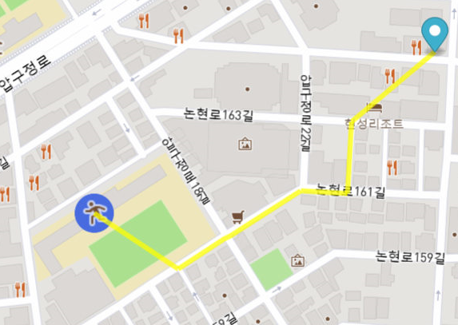
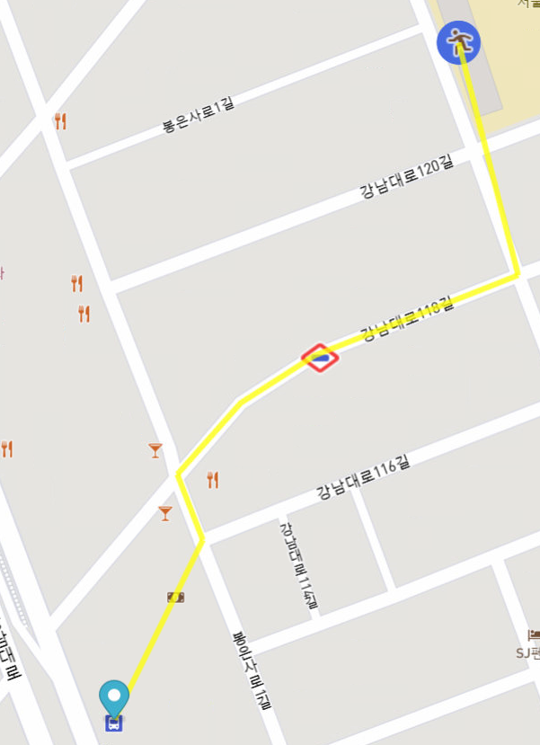
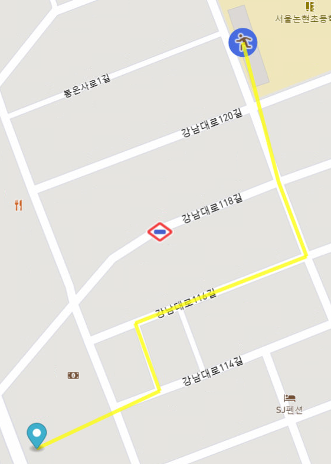
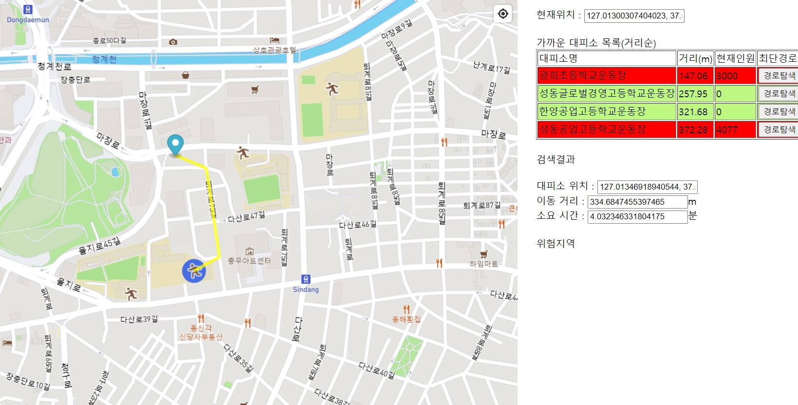
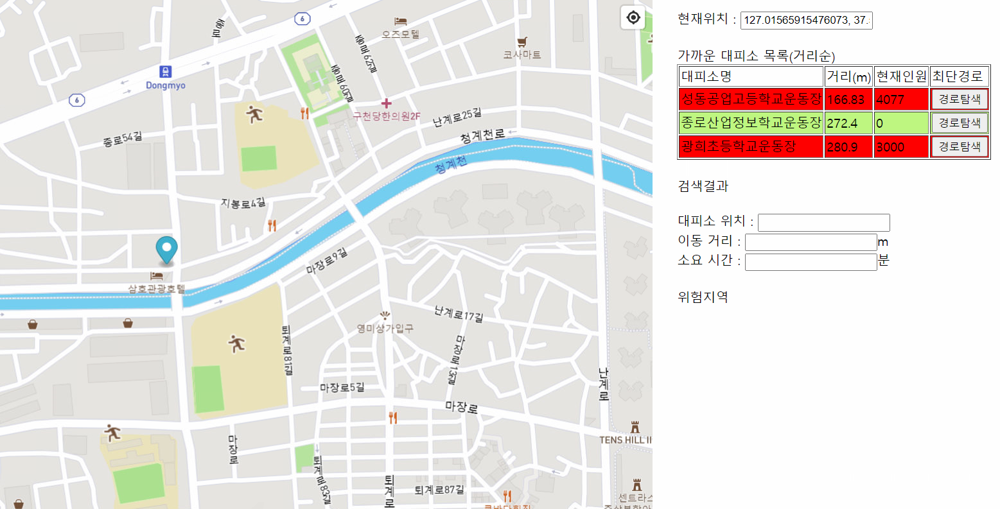

다음으로, 구축된 지도와 대피소 데이터, 도로 데이터를 기반으로 최단 경로 알고리즘을 구현하여야 한다. 먼저, 사용자의 위치를 지도 위에 표현하여야 한다. 이는 마커를 통해 사용자가 지도 위의 지점을 클릭했을 때 해당 지점으로 마커를 이동하여 사용자의 현재 위치 지점으로 설정한다.

사용자의 현재 위치가 설정되면, 해당 위치 인근에 위치한 대피소들을 탐색해야 한다. 이는 자바스크립트의 Turf.js 라이브러리를 활용하여 공간적인 데이터 분석 작업을 수행한다. Turf.js의 경우 Mapbox에서 연동하여 사용할 수 있는 공간 도구 라이브러리로, union, buffer, slice 등과 같은 다양한 기능을 제공한다. 이 중 buffer와 pointwithpolygon 기능을 활용하여 특정 범위 내에 속한 데이터를 추출할 수 있다.

```javascript
map.on('click', function(e) {
	  if (map.getLayer('path')) map.removeLayer('path');
      marker.setLngLat(e.lngLat);
      document.getElementById("txt1").value = e.lngLat.lng + ", " + e.lngLat.lat;
      var targetPoint = turf.point([e.lngLat.lng, e.lngLat.lat]);
      var shelFeatures = [];
      var shelter =  map.querySourceFeatures('shelter', {sourceLayer: 'points'});
      for(var i = 0; i < shelter.length ; i++){
          var cood = shelter[i].geometry.coordinates.slice();
          var nm= shelter[i].properties.지진해일대;
          if(shelFeatures.findIndex(i => i.properties.name == nm) == -1){
          shelFeatures.push(turf.point([cood[0], cood[1]], {name : shelter[i].properties.지진해일대, No : shelter[i].properties.No, maxCap : shelter[i].properties.최대수용인}));
          }
      }
      var points = turf.featureCollection(shelFeatures);
      var buffered = turf.buffer(targetPoint, 0.5, {units: 'kilometers'});
      var bufferinpoints = turf.pointsWithinPolygon(points, buffered);
...
```

위 코드는 지도 페이지에서 사용자가 지도를 클릭하여 현재 위치를 설정하고 해당 위치를 기준으로 일정 범위 내에 속한 대피소들을 찾아 저장하는 코드이다. turf.buffer함수를 사용하여 사용자의 현재 위치좌표가 할당된 targetpoint에서 0.5km 범위의 버퍼 영역을 생성하고, turf.pointsWithinPolygon 함수를 사용하여 대피소 데이터들이 할당된 points에서 해당 버퍼 영역에 속한 대피소들을 추출하여 저장하도록 구현하였다. 이 코드를 통해 사용자는 지도에서 현재 위치를 클릭하면 해당 위치에서 500m이내에 속한 인근 대피소 목록을 조회할 수 있다.


대피소 목록들을 조회하면, 현재 위치로부터 각 대피소까지 대피하는 최단 경로들을 구해야 한다. 이는 PostGIS가 제공하는 최단 경로 분석 알고리즘을 사용하여 계산할 수 있는데, 이를 위해 자바 클래스로 해당 함수들을 구현하고, Servlet을 통해 웹에서 각각의 기능이 실행되도록 구현한다. 

```java
public String getShortestPath(double marker_lng, double marker_lat, double shel_lng, double shel_lat){
    	String path = "";
    	String node_start = "";
    	String node_end = "";
    	double length = 0;
    	List<String> node_starts = getNearestNodes(marker_lng, marker_lat, 100);
    	System.out.println(node_starts.toString());
    	List<String> node_ends = getNearestNodes(shel_lng, shel_lat, 100);
    	try {
            conn = DriverManager.getConnection(url, user, password);
            st = conn.createStatement();
            String query = "SELECT sum(length_m) as length, (ST_Collect(the_Geom)) as result, start_vid, end_vid FROM pgr_dijkstra(\r\n" + 
            		"    'SELECT gid as id, source, target, cost, reverse_cost FROM ways',\r\n" + 
            		"     ARRAY"+node_starts.toString()+", ARRAY"+node_ends.toString()+"\r\n" + 
            		") as shortest, ways where gid=edge group by start_vid, end_vid order by sum(ways.cost) limit 1;";
            rs = st.executeQuery(query);
            System.out.println(query);
            while (rs.next()) {
            	path = rs.getString("result");
            	length = Double.parseDouble(rs.getString("length"));
            	node_start = rs.getString("start_vid");
            	node_end = rs.getString("end_vid");
            	}              
        } catch (SQLException sqlEX) {
            System.out.println(sqlEX);
        } finally {
            try {
                rs.close();
                st.close();
                conn.close();
            } catch (SQLException sqlEX) {
                System.out.println(sqlEX);
            }
        }
    ...
```

위 함수는 두 개의 위도, 경도 좌표를 입력받아 좌표간의 최단 경로를 계산하도록 구현한 함수이다. 쿼리문에서 사용한 알고리즘은 다익스트라 알고리즘으로, PostgreSQL이 제공하는 공간도구 라이브러리 중 하나인 pg_routing을 통해 최단 경로를 계산하는 pgr_dijkstra 함수를 통해 계산하였다. 

pg_routing은 노드-엣지로 구성된 그래프 형태에서 최단 경로를 계산하는 다양한 알고리즘 기능을 지원하는데, 그 중 일반적으로 많이 사용되는 다익스트라(Dijkstra) 알고리즘을 통해 도로 데이터가 노드-엣지의 그래프 형태로 저장된 ways 테이블에서 최단경로를 계산하도록 구현하였다. 

```javascript
$.ajax({
  		        type:"get",
  		        dataType:"text",
  		        async:true,  
  		        url:"http://localhost:8090/ShelterFinder/action",
  		        data: {m1:marker_cood[0], m2:marker_cood[1], t1:t1, t2:t2},
  		        beforeSend:function() {
    		        ...
      		      },
  		        success:function (k,textStatus){     	
  		        	d = JSON.parse(k);
  		        	document.getElementById("txt4").value = d['distance'];
  		        	document.getElementById("txt5").value = document.getElementById("txt4").value/83;
  		        	map.getSource('path').setData(d);
  		        	map.flyTo({center: [t1, t2], zoom:15.5});
  		        	if (map.getLayer('path')) map.removeLayer('path');
  		  		    map.addLayer({
  		  		    	'id': 'path',
  		  		    	'type': 'line',
  		  		    	'source': 'path',
  		  		    	'paint': {
  		  		    	'line-color': 'yellow',
  		  		    	'line-opacity': 0.75,
  		  		    	'line-width': 5
  		  		    	}
  		  		    	});
  		  		    map.getSource('nearest-shelter').setData({
  		  		      type: 'FeatureCollection',
  		  		      features: [
  		  		      nearestShelter
  		  		      ]
  		  		    });
  		  		  if (map.getLayer('nearest-shelter')) map.removeLayer('nearest-shelter');
  		  		    map.addLayer({
  		  		      id: 'nearest-shelter',
  		  		      type: 'circle',
  		  		      source: 'nearest-shelter',
  		  		      paint: {
  		  		        'circle-radius': 20,
  		  		        'circle-color': '#486DE0'
  		  		      }
  		  		    }, 'points');
  		        },
  		        error:function(data,textStatus){
  		           alert("경로탐색에 실패했습니다.");
  		        },
  		        complete:function(data,textStatus){
                    ...
  		        }
  		     });
```

위 코드는 지도 페이지에서 자바스크립트의 ajax를 통해 서블릿을 호출하여 최단 경로를 계산한 코드이다. 자바의 최단경로 계산 함수는 action 서블릿에서 실행되어 DB연동을 통해 최단 경로를 계산하도록 구현하였고, 결과값으로 나타난 최단 경로를 지도에 표시하여 해당 경로를 지도상에서 확인할 수 있도록 구현하였다.



지도 페이지에서 해당 기능을 실행하면 위와 같은 최단경로가 출력된다. 마커로 표시된 사용자의 현재 위치로부터 인근 대피소까지의 최단 경로가 계산되며, 해당 경로는 노란색으로 표시하여 사용자가 신속하게 해당 경로를 따라 대피할수 있도록 구현하였다.


다음으로, 지진 상황에서 건물 붕괴, 지반 침하 등의 상황 발생시 도로가 파손되어 이동이 제한되는 경우 해당 도로를 우회하여 대피소로 대피하는 상황이 발생할 수 있다. 따라서 이러한 상황 발생 시 우회된 최단 경로를 안내하여야 하므로 이동이 제한되는 도로를 지도에서 표시하고, 최단 경로 계산 시 해당 경로를 우회하여 안내하도록 설계해야 한다. 

이는, 일반적으로 지리 데이터 분석 과정에서 최단 경로 계산 시 우회해야 하는 엣지에 대한 cost를 매우 높은 값으로 부여하여 해당 경로를 지나지 않고 최단경로를 찾도록 수행한다. 따라서 데이터베이스에서 우회해야 하는 위험 도로에 대한 cost를 매우 높은 값으로 증가시켜서 우회경로를 탐색하도록 구현한다.

          

위 화면은 각각 기존 경로와 우회 경로를 탐색한 화면이다. 붉은 색 테두리의 표지판으로 표시된 우회경로가 지도상에 존재할 때, 대피소까지의 최단경로를 계산하는 경우 일반적으로 왼쪽 화면과 같이 이를 포함한 최단경로가 계산되지만, 해당 도로의 cost를 매우 높은 값으로 부여할 경우 오른쪽 화면과 같이 해당 도로를 우회하는 최단 경로를 탐색하게 된다. 따라서 이를 지진 상황에서 위험 도로를 피하여 안전한 대피 경로를 확보하는데 활용할 수 있다.


#### 결과



최종적으로 구현된 지진 대피소 최단경로 탐색 페이지는 위와 같다. 사용자가 지도를 클릭하여 현재 위치를 표시하면, 해당 위치에 마커가 표시되며 우측 공간에는 해당 지점으로부터 가까운 대피소 목록이 표시되고, 각각의 거리, 현재인원, 최단경로 탐색 버튼이 표시된다. 경로 탐색을 실행할 경우, 해당 대피소까지의 최단경로가 지도에 표시되며 검색결과로 대피소 위치좌표, 이동거리, 소요시간이 계산되어 출력된다.



특히, 대피소 데이터에는 각 대피소가 수용할 수 있는 최대 수용 인원에 대한 정보가 들어가 있는데, 이를 반영하여 현재 대피소에 대피한 현재 인원이 DB상으로 반영될 때, 대피소 조회 시 해당 인원을 출력하고 현재 인원이 최대 수용 인원을 초과한 경우 이를 구분하여 사용자에게 해당 대피소로 대피가 불가능함을 알리도록 구현하였다.


최종적으로, 본 연구를 통해 지진 상황 발생 시 사용자에게 현재 위치로부터 인근 대피소들을 탐색하여 안내하고 각 대피소까지 신속하고 안전하게 대피할 수 있는 대피경로를 안내하여 재난상황으로부터의 안전을 보장할 수 있다.

 

#### 한계점 및 보완사항

본 연구의 한계점으로는 먼저 최단 경로에 사용된 도로 데이터가 OSM에 기반한 도로 데이터를 사용하여 경로탐색을 수행하였기 때문에, 실제 지리적 환경에서 대피소까지 갈 수 있는 모든 경로를 제공하고 안내하기가 어렵다는 한계점이 있다. 이를 보완하기 위해 사람이 통행할 수 있는 도로에 대한 데이터를  수집하여 정밀한 도로 데이터를 구축해 최단 경로 탐색에 이를 활용해야 한다.

또한 단순히 2D 지도환경에서 대피경로를 탐색하였기 때문에 사용자가 현재 위치한 건물이나 구조물에 대한 실내 대피 경로를 안내하기가 제한된다. 따라서 단순 2차원 지리 데이터 뿐만 아니라 각 건물들에 대한 3D 실내 지도를 구축하여 이를 지진 대피 경로 안내에 활용해야 한다.

마지막으로 본 연구에서는 지진의 진원, 진앙, 규모,시간 등의 지진 데이터를 고려하지 않고 단순 대피경로를 탐색하였기 때문에, 실제로 이를 지진상황에서 활용하기 위해서는 실시간 재난 데이터를 반영하여 상황에 따라 유동적으로 맞춤형 경로를 제공해야 한다.