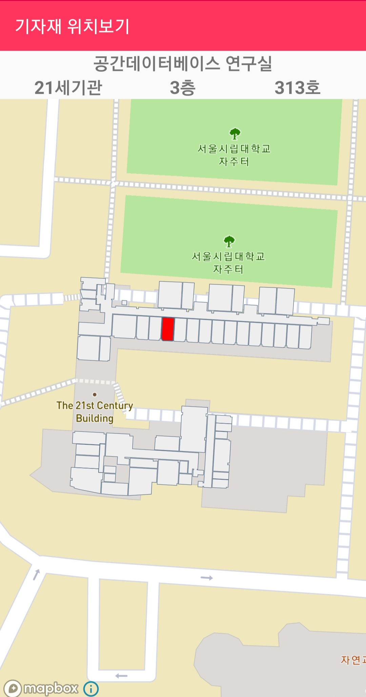
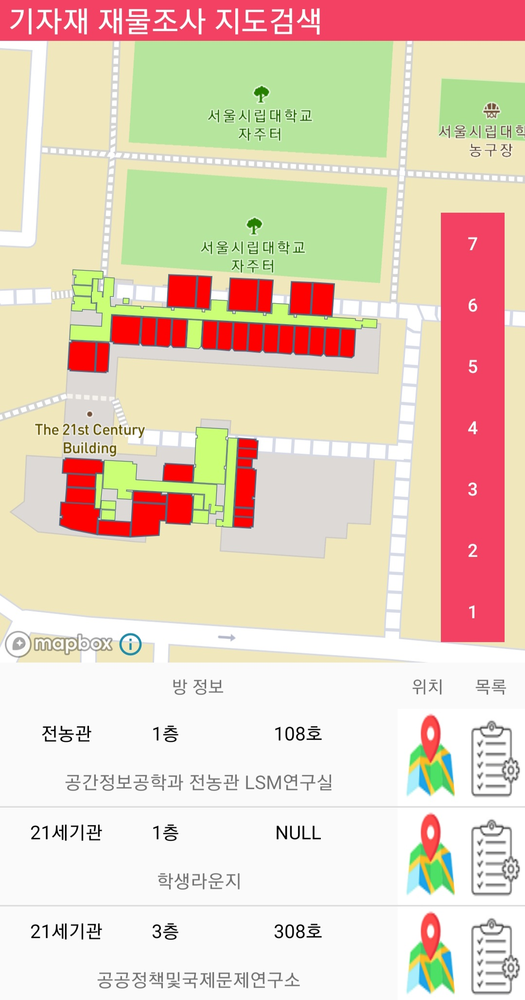
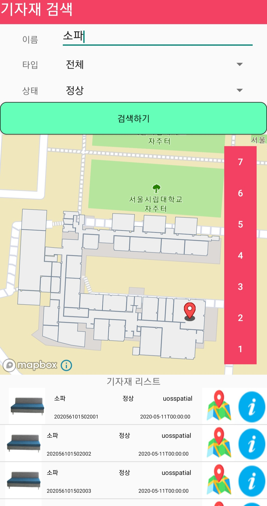
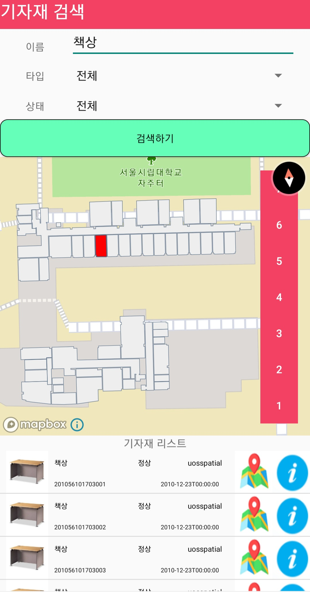

##### Mapbox Android Map

다음으로 내가 맡은 부분은 안드로이드 어플리케이션에서 Mapbox Tool을 통한 실내 지도 구현이다. 본 어플리케이션의 목적은 단순 텍스트 설명을 통한 일반적인 기자재 관리가 아니라 실제 지도 환경에서 각 건물과 방들에 대한 실내지도를 구축하고 이러한 실내지도를 통한 공간적인 관리가 이루어지는 것이다. 따라서 이를 위해 각 공간에 대한 데이터를 얻어 Mapbox 지도 위에 표현하고, 이에 대한 이벤트를 정의하여 다양한 작업들이 가능하도록 구현해야 한다. 

먼저 건물과 공간에 대한 데이터는 연구실의 도움을 받아 구할 수 있었는데, 해당 데이터는 shp파일 형태로 구성되어 있다. 이를 Mapbox Android에서 활용하기 위해 geojson 형태로 변환하고, 데이터를 각 건물별, 층별로 나누어 구분한다. 이렇게 저장한 geojson 파일을 Mapbox Android를 통해 Layer로 구현하여 지도상에서 표현하면 다음과 같은 그림으로 나타난다.


위 건물은 서울시립대학교에서 공간DB연구실이 속한 건물인 21세기관에 대한 공간데이터로 1층부터 7층까지의 각 방들로 구성된 층별 데이터를 구분하여 저장하였고, 우측 층별 버튼을 클릭하면 각 층에 해당하는 실내 지도가 출력되도록 구현하였다. 이를 구현한 코드는 다음과 같다.

```java
mapView = findViewById(R.id.mapView);
mapView.onCreate(savedInstanceState);
mapView.getMapAsync(new OnMapReadyCallback() {
    @Override
    public void onMapReady(@NonNull final MapboxMap mapboxMap) {
        Admin_Survey_Map.this.mapboxMap = mapboxMap;
        mapboxMap.setStyle(Style.MAPBOX_STREETS, new Style.OnStyleLoaded() {
            @Override
        public void onStyleLoaded(@NonNull Style style) {
               levelButtons = findViewById(R.id.floor_level_buttons);
               indoorBuildingSource = new GeoJsonSource("indoor-building", loadJsonFromAsset("21rooms_1_edited.geojson"));
               indoorBuildingSource2 = new GeoJsonSource("indoor-building2",
               loadJsonFromAsset("1rooms_1.geojson"));
               resultSource = new GeoJsonSource("result",
               loadJsonFromAsset("init.geojson"));
               selectedRoom = new GeoJsonSource("selected",
                                                loadJsonFromAsset("init.geojson"));
               allRooms = new GeoJsonSource("all",
                                            loadJsonFromAsset("all_rooms.geojson"));
               style.addSource(indoorBuildingSource);
               style.addSource(indoorBuildingSource2);
               style.addSource(resultSource);
               style.addSource(selectedRoom);
               style.addSource(allRooms);

// Add the building layers since we know zoom levels in range
               loadBuildingLayer(style);
                    }
                });

                Button buttonSeventhLevel = findViewById(R.id.seventh_level_button);
                buttonSeventhLevel.setOnClickListener(new View.OnClickListener() {
                    @Override
                    public void onClick(View view) {
                        indoorBuildingSource.setGeoJson(loadJsonFromAsset("21rooms_7_edited.geojson"));
                        resultSource.setGeoJson(fc_7);
                    }
                });

                Button buttonSixthLevel = findViewById(R.id.sixth_level_button);
                buttonSixthLevel.setOnClickListener(new View.OnClickListener() {
                    @Override
                    public void onClick(View view) {
                        indoorBuildingSource.setGeoJson(loadJsonFromAsset("21rooms_6_edited.geojson"));
                        resultSource.setGeoJson(fc_6);
                    }
                });

                Button buttonFifthLevel = findViewById(R.id.fifth_level_button);
                buttonFifthLevel.setOnClickListener(new View.OnClickListener() {
                    @Override
                    public void onClick(View view) {
                        indoorBuildingSource.setGeoJson(loadJsonFromAsset("21rooms_5_edited.geojson"));
                        resultSource.setGeoJson(fc_5);
                    }
                });

                ...

                Button buttonGroundLevel = findViewById(R.id.ground_level_button);
                buttonGroundLevel.setOnClickListener(new View.OnClickListener() {
                    @Override
                    public void onClick(View view) {
                        indoorBuildingSource.setGeoJson(loadJsonFromAsset("21rooms_1_edited.geojson"));
                        indoorBuildingSource2.setGeoJson(loadJsonFromAsset("1rooms_1.geojson"));
                        resultSource.setGeoJson(fc_1);
                    }
                });
            }
        });
```

코드를 보면 층별 방 데이터가 저장된 geojson 파일들을 불러와 GeojsonSource로 저장하고, 이를 Map의 Layer로 추가하여 지도에 표시하는 것을 확인할 수 있다. 이 때, 여러 개의 층에 대하여 버튼을 추가해 표시하고 싶은 층을 변경할 경우 GeojsonSource가 나타내는 Geojson 파일을 해당 층에 대한 파일로 변경하여 층별 실내지도를 구현하였다.

이러한 실내 지도를 활용하여 구현할 어플리케이션의 기능은 크게 3가지로 **기자재** **위치 조회, 재물조사, 기자재 검색기능**이 이에 해당한다. 각 기능에는 위의 지도 코드가 포함되며 실내 지도에서 특정 조건에 해당하는 방의 위치를 보여주는 역할을 한다


먼저 기자재 위치 조회기능이다. 각 기자재에는 현재 기자재가 위치한 방의 번호가 저장되어 있다. 따라서 특정 기자재의 위치를 조회할 경우 해당 방 번호를 통해 실내지도에서 기자재 위치를 표현할 수 있다.

```java
 mapView = findViewById(R.id.mapView);
        mapView.onCreate(savedInstanceState);
        mapView.getMapAsync(new OnMapReadyCallback() {
            @Override
            public void onMapReady(@NonNull final MapboxMap mapboxMap) {
                Admin_ComplaintConfirm_Map.this.mapboxMap = mapboxMap;
                mapboxMap.setStyle(Style.MAPBOX_STREETS, new Style.OnStyleLoaded() {
                    @Override
                    public void onStyleLoaded(@NonNull Style style) {
                        levelButtons = findViewById(R.id.floor_level_buttons);

                        indoorBuildingSource = new GeoJsonSource(
                                "indoor-building", loadJsonFromAsset("21rooms_1_edited.geojson"));
                        indoorBuildingSource2 = new GeoJsonSource(
                                "indoor-building2",loadJsonFromAsset("1rooms_1.geojson"));
                        resultSource = new GeoJsonSource("result",loadJsonFromAsset("init.geojson"));
                        allRooms = new GeoJsonSource("all",loadJsonFromAsset("all_rooms.geojson"));
                        style.addSource(indoorBuildingSource);
                        style.addSource(indoorBuildingSource2);
                        style.addSource(resultSource);
                        style.addSource(allRooms);
// Add the building layers since we know zoom levels in range
                        loadBuildingLayer(style);

                    }
                });

            }
        });


        mapView.addOnDidFinishLoadingMapListener(new MapView.OnDidFinishLoadingMapListener() {
            @Override
            public void onDidFinishLoadingMap() {
                List<CameraPosition> cp = new ArrayList<CameraPosition>();
                // INTENT로 방 번호 받아오기
                Intent intent = getIntent();
                int roomID = Integer.parseInt(intent.getExtras().getString("roomID"));
                // floor
                String floor = "null";
                String roomname;
                String buildingID;
                String buildingName = "null";
                String roomnumber;
                List<Feature> list = allRooms.
                    querySourceFeatures(eq(get("gid"),literal(roomID)));
                Feature f = list.get(0);
                floor = f.properties().get("floor").isJsonNull()?
                    "NULL":f.properties().get("floor").getAsString();
                roomname = list.get(0).properties().get("roomname").isJsonNull()?
                    "NULL":list.get(0).properties().get("roomname").getAsString();
                roomnumber = list.get(0).properties().get("roomnum").isJsonNull()?
                    "NULL":list.get(0).properties().get("roomnum").getAsString();
                TextView tv_floor = findViewById(R.id.textView_floor);
                TextView tv_building = findViewById(R.id.textView_building);
                TextView tv_roomnum = findViewById(R.id.textView_roomnum);
                TextView tv_roomname = findViewById(R.id.textView_roomname);
                tv_floor.setText(Integer.parseInt(floor)+"층");
                buildingID = f.properties().get("buildingid").isJsonNull()?
                    "NULL":f.properties().get("buildingid").getAsString();
                if(buildingID.equals("01"))
                    buildingName="전농관";
                else if(buildingID.equals("15"))
                    buildingName="21세기관";
                tv_building.setText(buildingName);
                if(!roomnumber.equals("NULL"))
                    roomnumber += "호";
                tv_roomnum.setText(roomnumber);
                tv_roomname.setText(roomname);
                CameraPosition ps1 = new CameraPosition.Builder()
                        .target(new LatLng(37.583452,127.056545))
                        .zoom(18)
                        .build();
                CameraPosition ps2 = new CameraPosition.Builder()
                        .target(new LatLng(37.583192,127.058675))
                        .zoom(18)
                        .build();
                if(buildingID.equals("01")){
                    mapboxMap.setCameraPosition(ps1);
                }else if(buildingID.equals("15")){
                    mapboxMap.setCameraPosition(ps2);
                }
                if(floor.equals("01")){                    indoorBuildingSource.setGeoJson(loadJsonFromAsset("21rooms_1_edited.geojson"));          indoorBuildingSource2.setGeoJson(loadJsonFromAsset("1rooms_1.geojson"));
                }
                else if(floor.equals("02")){                    indoorBuildingSource.setGeoJson(loadJsonFromAsset("21rooms_2_edited.geojson"));
              ...                  
                resultSource.setGeoJson(f);
            }
        });
    }
```

위 코드는 특정 방 번호를 Intent를 통해 전달받은 경우 전체 방 데이터 중 해당 방 번호를 Key로 검색하여 찾은 방을 표시하는 코드이다. 넘겨받은 RoomID로 방을 찾는데 이때 `List<Feature> list = allRooms.querySourceFeatures(eq(get("gid"),literal(roomID)));` 부분에서 RoomID를 찾게 된다. `querySourceFeatures`의 경우 특정 GeojsonSource가 갖고 있는 프로퍼티 중 검색하고자 하는 Key값으로 geojson에 대한 feature를 검색하는 기능이다. 여기서는 모든 방 데이터가 저장된 `allrooms`에서 RoomID에 해당하는 프로퍼티 gid를 Key값으로 설정하고 전달받은 RoomID를 통해 검색하도록 구현하였다. 검색 결과로 받은 feature는 `resultSource`에 저장되며 해당 소스가 지도 위에서 출력되도록 작동한다.



앱에서 실제 구현된 모습을 확인하면 검색결과로 나타난 방을 붉게 표현하여 해당 방의 위치를 지도 위에 표현하였고 상단부분에는 방에 대한 이름, 건물, 층, 호실과 같은 위치정보를 표현하여 사용자가 위치를 쉽게 알 수 있도록 구현하였다. 


다음은 재물조사 기능이다. 재물조사는 재무과에서 2년에 한번씩 실시하며 학교 전체의 기자재의 수량과 상태를 파악하는 과정으로, 기자재 관리에 있어서 중요한 기능이라 할 수 있다. 기존의 방식은 기자재 목록이 작성된 실제 문서를 가지고 각 건물의 방별로 재물조사가 이루어지지 않은 방을 목록에서 일일이 확인하며 진행하였으나, 이 어플리케이션을 통해 지도상에서 재물조사 여부에 대한 현황을 표시하여 사용자에게 직관적이고 편리한 방법으로 진행할 수 있도록 구현하였다.

```java
mapView.addOnDidFinishLoadingMapListener(new MapView.OnDidFinishLoadingMapListener() {
            @Override
            public void onDidFinishLoadingMap() {
                List<CameraPosition> cp = new ArrayList<CameraPosition>();
                List<Feature> list_1= new ArrayList<Feature>();
                List<Feature> list_2= new ArrayList<Feature>();
                List<Feature> list_3= new ArrayList<Feature>();
                List<Feature> list_4= new ArrayList<Feature>();
                List<Feature> list_5= new ArrayList<Feature>();
                List<Feature> list_6= new ArrayList<Feature>();
                List<Feature> list_7= new ArrayList<Feature>();
                String floor = "null";
                String roomname;
                String buildingID;
                String roomnumber;
                for(int i=0;i<roomnum.size();i++){
                    List<Feature> list = allRooms.querySourceFeatures(eq(get("gid"),literal(roomnum.get(i))));
                    floor = list.get(0).properties().get("floor").isJsonNull()?"NULL":list.get(0).properties().get("floor").getAsString();
                    roomname = list.get(0).properties().get("roomname").isJsonNull()?"NULL":list.get(0).properties().get("roomname").getAsString();
                    buildingID = list.get(0).properties().get("buildingid").isJsonNull()?"NULL":list.get(0).properties().get("buildingid").getAsString();
                    roomnumber = list.get(0).properties().get("roomnum").isJsonNull()?"NULL":list.get(0).properties().get("roomnum").getAsString();
                    if(buildingID.equals("01"))
                        buildingID="전농관";
                    else if(buildingID.equals("15"))
                        buildingID="21세기관";
                    String floorasString = Integer.toString(Integer.parseInt(floor))+"층";
                    if(!roomnumber.equals("NULL"))
                        roomnumber += "호";
                    adapter.addItem(buildingID,floorasString,roomnumber,roomname,roomnum.get(i),date);
                    adapter.notifyDataSetChanged();
                    switch (floor){
                        case "01":
                            list_1.add(list.get(0));
                            break;
                        case "02":
                            list_2.add(list.get(0));
                            break;
                        case "03":
                            list_3.add(list.get(0));
                            break;
                        case "04":
                            list_4.add(list.get(0));
                            break;
                        case "05":
                            list_5.add(list.get(0));
                            break;
                        case "06":
                            list_6.add(list.get(0));
                            break;
                        case "07":
                            list_7.add(list.get(0));
                            break;
                    }

                }
                fc_1 = FeatureCollection.fromFeatures(list_1);
                fc_2 = FeatureCollection.fromFeatures(list_2);
                fc_3 = FeatureCollection.fromFeatures(list_3);
                fc_4 = FeatureCollection.fromFeatures(list_4);
                fc_5 = FeatureCollection.fromFeatures(list_5);
                fc_6 = FeatureCollection.fromFeatures(list_6);
                fc_7 = FeatureCollection.fromFeatures(list_7);

                resultSource.setGeoJson(fc_1);
            }
        });
```

이 또한 앞서 기자재 위치조회에서 구현한 방식과 마찬가지로 재물조사가 진행되지 않은 방의 roomID 목록을 전달받아서 `querySourceFeatures`를 통해 해당 방들을 검색하여 층별 결과 collection에 저장하는 형태로 구현하였다. 따라서 지도에는 재몰조사가 완료되지 않은 방들이 앞서 저장한 collection으로 출력되며 각 층별 collection은 사용자가 표시하고자 하는 층을 클릭할 때 해당 층의 collection이 출력된다.



위 화면은 기자재 재물조사 작업 목록 중 현재 진행중인 재물조사 작업을 클릭하였을 때 해당작업에서 재물조사 현황에 대한 지도를 출력하는 액티비티로 건물의 각 층별로 기자재 재물조사가 완료되지 않은 방들이 붉은색으로 표시된 것을 확인할 수 있다. 따라서 사용자는 기자재 재물조사 시 어떤 방이 재물조사가 완료되지 않았는지 직관적이고 쉽게 알 수 있으며 이를 통해 편리한 작업이 가능해진다.

화면 하단에는 재물조사 미완료 방들의 목록이 출력되는데, 위치 버튼을 클릭하면 해당 방의 위치로 지도가 확대되며 목록 버튼을 클릭하면 해당 방의 기자재 목록이 출력되면서 재물조사가 진행되도록 구현하였다.


마지막으로 기자재 검색 기능의 경우, 기존 방식은 전산 시스템에서 해당 기자재에 대한 정보를 입력하여 검색하도록 되어있으나, 본 어플리케이션에는 보다 다양한 검색 필터를 적용하여 기자재를 검색하거나 실내 지도상에서 특정 방을 선택하여 해당 방에 속한 기자재를 공간적으로 검색하도록 구현하였다.

```java
 try {
                ArrayList<Integer> roomnum = new ArrayList<Integer>();
                List<Feature> list_1= new ArrayList<Feature>();
                List<Feature> list_2= new ArrayList<Feature>();
                List<Feature> list_3= new ArrayList<Feature>();
                List<Feature> list_4= new ArrayList<Feature>();
                List<Feature> list_5= new ArrayList<Feature>();
                List<Feature> list_6= new ArrayList<Feature>();
                List<Feature> list_7= new ArrayList<Feature>();
                JSONArray array = new JSONArray(s);
                String floor;
                for(int i=0;i<array.length();i++){
                    JSONObject object = array.getJSONObject(i);
                    String name = object.getString("name_KR");
                    String equipno = object.getString("equipNo");
                    roomnum.add(Integer.parseInt(roomno));
                    ...
                    adapter.addItem(ImgUrl,name,equipno,roomno, adminID, status, inDate);
                    adapter.notifyDataSetChanged();
                }
                for(int i=0;i<roomnum.size();i++){
                    List<Feature> list = allMarkers.querySourceFeatures
                        (eq(Expression.get("gid"),literal(roomnum.get(i))));
                    floor = list.get(0).properties().get("floor").isJsonNull()?
                        "NULL":list.get(0).properties().get("floor").getAsString();
                    switch (floor){
                        case "01":
                            list_1.add(list.get(0));
                            break;
                        case "02":
                            list_2.add(list.get(0));
                            break;
                            ...
                    }

                }
                fc_1 = FeatureCollection.fromFeatures(list_1);
                fc_2 = FeatureCollection.fromFeatures(list_2);
     				...

                switch(nowfloor){
                    case 1:
                        resultMarkers.setGeoJson(fc_1);
                        break;
                    case 2:
                        resultMarkers.setGeoJson(fc_2);
                        break;
                        ...
                }
            }catch (Exception e){
                e.printStackTrace();
            }
```

위 코드는 기자재 검색 기능 중 검색 결과를 지도 위에 표현하는 코드로, 조건에 따라 기자재를 검색하였을 때 검색 결과로 전달받은 기자재들의 방 목록을 저장하여 해당 방 목록을 통해 앞서 재물조사와 마찬가지로 `querySoruceFeatures` 메서드로 전체 방 목록중 기자재 위치한 방들을 검색하여 지도 위에 표시하도록 구현하였다. `JSONArray array = new JSONArray(s)` 에서 s는 기자재 검색 결과로 전달 받은 기자재 목록에 대한 string 형 변수로 이를 JSONArray 형태로 파싱하여 각 기자재별 방 번호인 RoomID를 전달받아 `roomnum.add(Integer.parseInt(roomno))` 형태로 방 번호를 roomnum 리스트에 저장하고, 해당 리스트의 각 번호를 `querySourceFeatures`  를 통해 기자재가 위치한 방들을 찾도록 구현하였다.


다음으로, 사용자가 검색 필터를 설정하여 단순히 검색할 뿐만 아니라, 지도상에서 특정 방에 존재하는 기자재 목록을 찾고자 할 때 해당 방을 직접 클릭하여 기자재를 검색하는 기능을 구현하였다.

```java
public boolean onMapClick(@NonNull LatLng point) {
        adapter.remove();
        adapter.notifyDataSetChanged();
        PointF pointf = mapboxMap.getProjection().toScreenLocation(point);
        List<Feature> featureList = 
            mapboxMap.queryRenderedFeatures(pointf,"indoor-building-fill");
    if (featureList.size() > 0) {
            for(int i=0;i<featureList.size();i++){
                Feature f = featureList.get(i);
                selectSource.setGeoJson(f);
                int a = 
          f.properties().get("gid").isJsonNull()0:f.properties().get("gid").getAsInt();
                String url = "http://geodb.uos.ac.kr/qr/api/room/equipment_condt_img";
                JSONObject condts = new JSONObject();
                String condt = "";
                try{
                    if(equipment_name.getText()!=null)
                        condt +=
                        "name_KR LIKE '%"+equipment_name.getText().toString()+"%'";
                    if(!equipment_status.getSelectedItem().toString().equals("전체"))
                        condt+=
                        "AND status='"+equipment_status.getSelectedItem().toString()+"'";
                    if(!equipment_type.getSelectedItem().toString().equals("전체"))
                        condt+=
                        "AND type='"+equipment_type.getSelectedItem().toString()+"'";
                    if(!equipment_admin.getText().toString().equals(""))
                        condt+=
                        "AND adminID LIKE '%"+equipment_admin.getText().toString()+"%'";
                    if(!equipment_startDate.getText().toString().equals(""))
                        condt+=
                        "AND inDate>='"+equipment_startDate.getText().toString()+"'";
                    if(!equipment_endDate.getText().toString().equals(""))
                        condt+=
                        "AND indate<='"+equipment_endDate.getText().toString()+"'";
                    if(!equipment_name.getText().toString().equals(""))
                        condt.replaceFirst("AND","");
                    condt +="AND roomID="+a;
                    condts.accumulate("condt",condt);
                }catch (Exception e){
                    e.printStackTrace();
                }
                NetworkTask2 networkTask = new NetworkTask2(url,condts.toString());
                networkTask.execute();
            }
            return true;
        }
        return false;
    }
```

코드는 Mapbox의 지도 클릭 이벤트인 `onMapClick` 이벤트 메서드를 통해 방 클릭에 대한 기자재 검색 기능을 구현하였다. 변수 pointF에는 사용자가 클릭한 위치의 좌표가 저장되는데, 해당 좌표를 `queryRenderedFeatures` 메서드를 통해 전체 건물의 Layer에서 클릭한 방에 대한 Feature 데이터를 찾도록 되어있다. 이후 클릭한 방에 해당하는 Feature 데이터를 통해 해당 방의 roomid를 기자재 검색의 조건으로 입력하여 해당 방의 속한 기자재 목록을 조회하도록 구현하였다.



위 화면은 먼저 기자재 검색기능에서 사용자가 필터를 적용하고 검색버튼을 클릭하여 특정 기자재를 검색한 사진이다. 전체 기자재 중 상태가 정상인 소파를 찾고싶을 때, 위와 같이 화면 상단의 기자재 조건을 설정하고 검색하기 버튼을 클릭한 경우 화면 하단에 해당 기자재 목록이 출력되며 각 기자재가 위치한 방이 지도상에서 마커로 표시된다.



다음은 사용자가 특정 방을 클릭하여 해당 방에 위치한 기자재를 검색하는 사진이다. 화면의 실내지도에서 특정 방에 속한 책상 목록을 보고싶을 때, 필터를 설정하고 특정 방을 클릭하면 해당 방에 속한 책상 목록이 화면 아래 표시되는 것을 알 수있다.


------

이 외에 다른 다양한 기능이나 보다 자세한 설명을 참고하고자 하면 아래 링크를 통해 전체 어플리케이션에 대한 설명을 확인할 수 있고, 앱을 직접 스마트폰에 설치하여 체험할 수 있다.

[EasyTag 링크 바로가기](https://uos-urbanscience.org/archives/uos_portfolio/easy-tag-%ea%b3%b5%ea%b0%84%eb%8d%b0%ec%9d%b4%ed%84%b0%eb%b2%a0%ec%9d%b4%ec%8a%a4%ec%99%80-qr%ec%bd%94%eb%93%9c%eb%a5%bc-%ed%99%9c%ec%9a%a9%ed%95%9c-%ea%b8%b0%ec%9e%90%ec%9e%ac-%ea%b4%80%eb%a6%ac)